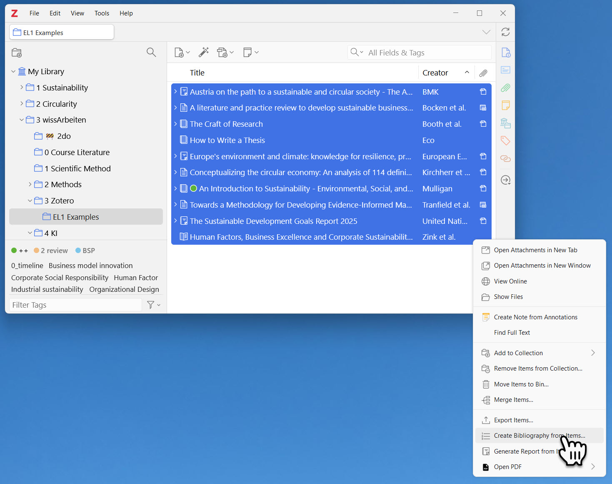
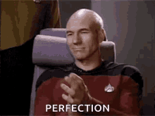

# Welcome to the Electronic Learning (EL) Session 1!

In this unit you will:

* Learn how to install and user Zotero for managing your literature;
* Practice searching for and storing literature in Zotero;
* Create a bibliography in APA style.

👉 Just one last thing: Before you move on, open a Word document to reflect on your learning experience or answer some questions that will be posed to you during the session. This document will be further referenced as reflection document. 

> 🤔 **Questions for reflections** will be marked like this. Give brief answers, not more than three sentences.

And yes, at the end of the session you will be asked to submit this reflection document. This document will not be graded, but you have to hand it in in order to finish this course.

**Sounds good?** Then let's get started!

## Getting Started with Zotero

First things first: You can find Zotero at [www.zotero.org](https://www.zotero.org/).

[Steven Bradburn](https://www.youtube.com/channel/UCt6BcqswUGbQfor28NDCbvw) has prepared a nice video tutorial on how to get started with Zotero. Have a look at it and work your way through the video:

  
 
> 🤔 **Which functions of Zotero do you find especially useful?** Write a brief answer in your reflection document.

## Finding Materials and Getting Them into Zotero

**Here is a short quest for you:** Find the following 10 materials and get them into your Zotero library (e.g. in a subcollection called "Quest 1"). Use the search portals we covered in the lecture.

**👉 Tip:** For some of the listed materials, you may need to manually update the bibliographical information retrieved by Zotero or enter it into Zotero yourself.

| No. | Type | Example Source |
|-----|------|----------------|
| 1 | Book | Eco, Umberto (2015). How to Write a Thesis. MIT Press. |
| 2 | Book | Booth, W. C., Colomb, G. G., & Williams, J. M. (2016). The Craft of Research (4th ed.). University of Chicago Press. |
| 3 | Book | Mulligan, M. (2018). An Introduction to Sustainability—Environmental, Social, and Personal Perspectives (2nd ed). Routledge. |
| 4 | Book chapter | Zink, K. J., Steimle, U., & Fischer, K. (2008). Human Factors, Business Excellence and Corporate Sustainability: Differing Perspectives, Joint Objectives. In K. J. Zink (Ed.), Corporate Sustainability as a Challenge for Comprehensive Management (pp. 3–18). Physica-Verlag HD. |
| 5 | Journal article | Tranfield, D., Denyer, D., & Smart, P. (2003). Towards a methodology for developing evidence-informed management knowledge by means of systematic review. British Journal of Management, 14(3), 207–222. |
| 6 | Journal article | Bocken, N. M. P., Short, S. W., Rana, P., & Evans, S. (2014). A literature and practice review to develop sustainable business model archetypes. Journal of Cleaner Production, 65, 42–56. |
| 7 | Journal article | Kirchherr, J., Reike, D., & Hekkert, M. (2017). Conceptualizing the circular economy: An analysis of 114 definitions. Resources, Conservation and Recycling, 127, 221–232. |
| 8 | Report | European Environment Agency. (2025). Europe’s environment and climate: Knowledge for resilience, prosperity and sustainability. (No. 07/2025; EEA Report). European Environment Agency. |
| 9 | Report | United Nations Department of Economic and Social Affairs. (2025). The Sustainable Development Goals Report 2025. |
| 10 | Report | BMK. (2022). Austria on the path to a sustainable and circular society—The Austrian Circular Economy Strategy. Austrian Ministry for Climate Action, Environment, Energy, Mobility, Innovation and Technology. |

**All set?** Then it's time for the last step of this session:

## Creating a Bibliography

Create a bibliography of the materials you have collected in the quest. You can do this by selecting all items in your "Quest 1" collection, right-clicking, and choosing "Create Bibliography from Collection": 

Select APA as citation style and "copy to clipboard" as output method. This way you can paste the bibliography into your reflection document. And in case you are curious, here is how the final bibliography should look like: [Quest Bibliography](el1_zotero_bib_v1.pdf).

Almost done ...

> 🤔 **How easy or difficult was it for you to find the materials and get them into Zotero? What challenges did you face?** Write a brief answer in your reflection document.

## What Now?

Save your reflection document under your **family name (e.g. "huber.docx")** and **upload** it in the **MS Teams Folder "Electronic Learning Session 1"**.

Congratulations for finishing this electronic learning session! 🎉

