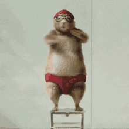

# Electronic Learning Session 2: Reviewing (and Grading) a Seminar Paper

This self-guided e-learning activity prepares you to **critically review a seminar paper** using a transparent set of assessment criteria.

**🤔 But wait: Shouldn't we first learn how to *write* a seminar paper?**

In this exercise, we take a **reverse approach** to learning how to write a seminar paper. Instead of starting with general writing guidelines, you will first explore the **assessment criteria** that your final seminar papers will be evaluated against. By seeing what counts as high-quality academic work from the reviewer’s perspective, you will gain a clearer understanding of how to structure your own paper, which elements to prioritise, and how to avoid common pitfalls. 

In other words: by learning how to **review** a seminar paper, you also learn how to **write** a strong one. This “review-first” method helps you recognise good academic practice more quickly and apply it directly to your own work.

After completing this session, you will be able to

-   identify **key quality criteria** of a seminar paper
-   apply **formal assessment** criteria to a concrete example
-   **justify your review** and grading decisions in a transparent and structured way
-   use these insights to **improve your own writing skills**

**Sounds good?** Then let's get started!

# 1. Criteria for Reviewing Seminar Papers

👉 Please be aware that the criteria used in this session are **specific to seminar papers** and may differ from those used for other types of academic writing, such as research articles or theses.

In this chapter, we present the **detailed criteria used to review and grade seminar papers** in this course. These criteria are designed to ensure that your work meets high academic standards and effectively communicates your findings. In the following chapters, we break down each of these five criteria into specific aspects that you should consider when writing and reviewing seminar papers:

1. **Report design:** Clear and appealing layout
2. **Scientific formalities:** Correct and consistent
3. **Outline and general structure:** Logical and coherent
4. **Introduction and conclusion:** Well-developed and coordinated
5. **Argumentation:** Clear, logical and well-supported

## 1.1 Report Design: Clear and appealing Layout

To come up with a clear and appealing **report design**, pay attention to the following aspects:

### Design of and Content on the Title Page

-   **University, programme / institute**\
    This information clearly identifies the institutional context of the work and ensures formal completeness. It also signals that the paper follows the conventions of your programme.
-   **Course name, number and semester**\
    These details help position the paper within a specific course and academic timeframe, which is essential for documentation and assessment.
-   **Course instructor**\
    Mentioning the instructor allows the paper to be properly assigned and provides clarity for administrative processes.
-   **Student name and matriculation number**\
    This ensures authorship is transparent and allows the work to be unambiguously matched to the correct student.
-   **Clear, meaningful title (and subtitle)**\
    The title should reflect the topic of the paper precisely and provide immediate orientation about its focus. A subtitle can help narrow down the theme or indicate methodological aspects.
-   **Graphic design: connection to the topic; visible effort**\
    The design should support readability and show that care was taken to produce a professional document. Visual elements should be relevant and not distract from the academic purpose.

### Completeness and Design of the core Text

-   **Visible effort in formatting and design**\
    A well-designed document signals academic professionalism and attention to detail, both of which are indicators of quality scientific work.
-   **Table of contents**\
    A clear table of contents provides an overview of the structure and enables the reader to navigate the document efficiently. As a rule of thumb: if the paper exceeds 5 pages, a table of contents is expected.
-   **If applicable: List of illustrations**\
    This list helps readers locate figures and supports transparency regarding visual material used. Again a rule of thumb: if there are more than 3 illustrations, a list is expected. The list should include figure numbers, titles and page numbers and come after the table of contents.
-   **Bibliography**\
    The bibliography includes all sources used and shows that the author has engaged with academic literature in a systematic way. the format should be consistent and follow academic standards like the APA style we discussed in class. The bibliography allways appears at the end of the paper.
-   **Layout: readability, page structure, orientation in the text**\
    Good layout ensures that the text is accessible, with appropriate spacing, fonts and consistent formatting that guide the reader. If not indicated otherwise, papers should follow standard page formatting, with a left margin of 2.5 cm and margins of 2 cm on the right, top and bottom to ensure readability.

## 1.2 Scientific Formalities: Correct and Consistent

To ensure **scientific formalities** are correctly and consistently applied, consider the following aspects:

### Citation – Formal Aspects

-   **One consistent citation style**\
    Using a single style - like 🔗 [APA](https://apastyle.apa.org/style-grammar-guidelines/references/examples) - throughout the paper shows discipline and avoids confusion for readers and reviewers.
-   **Correct and standardised use (in-text and bibliography)**\
    Citations should follow the rules of the chosen style precisely throughout the whole text.
-   **Use of short references (author-year)**\
    Short references increase readability and make it easier to link statements to their sources without disrupting the text flow.
-   **Bibliography: completeness and clear structure**\
    All cited works must appear in the bibliography, which should be organised according to the chosen style to support orientation and verification.

### Citation Usage

-   **Appropriate use of direct quotations**\
    Direct quotes should only be used when the exact wording is essential, for example when definitions or very specific formulations are required.
-   **Reasonable quantity of direct quotes**\
    Excessive quoting can weaken the author’s own argument, so quotes should be used sparingly.
-   **Appropriate use of indirect quotations (aka "paraphrasing")**\
    Paraphrasing shows that the student understands the content and can integrate it into their own argument. Each paraphrased idea must still be properly referenced.
-   **No “paragraph quotation” without clear source**\
    Every piece of external information requires a clear citation; otherwise, academic misconduct (= plagiarism) may be suspected.
-   **Quality and scope of sources**\
    Sources should be relevant, credible and sufficiently academic. A solid range of sources shows research effort and topic familiarity.
-   **Sufficient number of sources for the topic**\
    A well-researched paper includes enough literature to support arguments without relying on only one or two authors.

### Tables, Figures and Maps

-   **Correct citation of data sources, external figures and tables**\
    Any external visual material must be credited to avoid copyright violations and maintain scientific transparency.
-   **Clear labelling (titles, axis labels, legends, figure numbers)**\
    Visuals must be understandable on their own, providing all necessary information for interpretation.
-   **Graphic/cartographic quality and integrity**\
    Figures and maps should be readable and professionally formatted, without distortions or misleading visualisations.
-   **Quality of underlying data**\
    Data must come from reputable sources to ensure the validity of the argumentation.
-   **Figures and tables are explained in the text and necessary for the argument**\
    Visuals should support the narrative and never appear without discussion. They must serve a clear analytical purpose.
-   **Interpretation of figures, tables and maps is clear and meaningful**\
    Readers should understand how the data contributes to the research question and what conclusions can be drawn.

---

## 👉 Time for a short break! ☕

---

## 1.3 Outline and General Structure: Logical and Coherent

In order to achieve a **logical and coherent outline and general structure**, focus on the following aspects:

### Table of Contents

-   **Headings are meaningful and informative**\
    Good headings reflect the content of each section and guide the reader through the text.
-   **Headings are coherent at each level**\
    Hierarchical consistency makes the structure logical and prevents confusion. Lower-level headings should relate clearly to their higher-level counterparts.
-   **Clear “red thread” through the text and headings**\
    The central argument should unfold step by step, and the chapters should follow a logical sequence. The overall story line should become apparent from the table of contents.

### Core Text

-   **Reasonable balance between chapters**\
    Sections should be proportional, preventing overly long or extremely short chapters that could disrupt reading flow. As a rule of thumb, no chapter should be less than half or more than double the average chapter length.
-   **Chapters have clear internal structure**\
    Each chapter should build up logically, using paragraphs effectively to separate thoughts.
-   **Headings should have a good correspondence to thier content**\
    The text under each heading should match what the heading promises, ensuring consistency and predictability.
-   **One paragraph = one thought**\
    This helps maintain clarity and keeps the argument focused.
-   **Chapter length is appropriate**\
    Chapters should be long enough to develop content but concise enough to remain readable. Use subchapters if necessary to break down complex topics.
-   **Chapter structure corresponds to research objective and questions**\
    The structure should clearly follow from what the paper aims to investigate.
-   **Clear separation of “presentation of content” and “discussion of content”**\
    Presenting theory or empiric results is not the same as analysing or critiquing it. Keeping these separate - putting them in different chapters - helps academic rigour and allows readers to critically assess the argumentation.

## 1.4 Introduction and Conclusion: Well-developed and Coordinated

To create a **well-developed and coordinated introduction and conclusion**, consider the following aspects:

### Introduction

-   **Introduces the topic and motivates the study**\
    A strong introduction explains why the topic matters and why it is worth exploring academically.
-   **Coherent presentation of the context**\
    Background information provides the necessary framing for the reader and prepares them for the research objectives and questions.
-   **Clear, well-formulated research objective**\
    The objective tells the reader what the paper intends to achieve academically.
-   **Clear, well-formulated research question(s)**\
    Research questions guide the structure and analysis. They must be precise and answerable.
-   **Brief outlook on the structure of the paper**\
    This serves as a “roadmap” that helps readers anticipate what comes next.
-   **Good linguistic quality**\
    The introduction should be readable, engaging and free of language errors, setting the tone for the rest of the paper.

### Conclusion

-   **Provides a concise general framing of the work**\
    The conclusion briefly summarises key arguments and reflects on the paper’s aim.
-   **Does not introduce new findings or literature**\
    Conclusions should synthesise what has been said, not add unexpected new information.
-   **Clearly addresses the research objective and questions**\
    A good conclusion explicitly answers the research questions posed in the introduction.
-   **Presents answers linked to the analysis in the main part**\
    All conclusions must be based on evidence and argumentation from the paper itself.
-   **Critical self-assessment of how well the questions were answered**\
    Recognising limitations shows reflective academic thinking.
-   **Good linguistic quality**\
    The closing section should read smoothly and leave a coherent final impression.

### Balance between Introduction and Conclusion

When reading the introduction and conclusion together, they should form a **coherent pair** that frames the entire paper effectively:
*  The introduction sets up the research problem, stating what questions will be answered
*  The conclusion provides clear answers to those questions.

**👉 Classical imbalances:** The conclusions answers non-stated questions, or the introduction includes questions which have not been answered in the conclusion.

## 1.5 Argumentation: Clear, Logical and Well-Supported

To ensure **clear, logical and well-supported argumentation**, focus on the following aspects:

### Readability

-   **Clear and simple language**\
    Ideas should be expressed in a straightforward and accessible way, ensuring readers can follow the argumentation.
-   **Reasonable sentence length**\
    Avoiding overly long sentences helps maintain clarity and reduces the risk of confusion. Again, as a rule of thumb: sentences should in general not exceed two lines of text.
-   **Important terms are clearly defined and used consistently**\
    Defining concepts ensures conceptual clarity and prevents misunderstandings.

### Logical Structure of the Core Text

-   **Chapters build logically on each other**\
    Each chapter should contribute to developing the central argument step by step.
-   **Clear relationships between chapters**\
    Transitions should show how each chapter relates to the overall research question.
-   **Visible “red thread”**\
    A coherent line of reasoning must be identifiable throughout the paper.

### Coherence of Argumentation

-   **Interim summaries support orientation**\
    Short summaries help readers understand key insights before moving on to new sections.
-   **Transitions between chapters are clear**\
    Linking sections ensures argument continuity and narrative flow.
-   **Arguments follow a logical sequence**\
    Claims must be ordered in a way that builds understanding rather than causing confusion.
-   **Methodological and content-related choices are justified**\
    Explaining why certain methods or sources were chosen strengthens academic credibility.

### Use of Cases and Literature

-   **Case studies are used appropriately**\
    Cases should serve as evidence and help illustrate theoretical points. Therefore their selection must be justified.
-   **Independence of argumentation**\
    The paper should present the student’s own analysis, not just a summary of what others have written.
-   **Ambiguities and limitations are clearly labelled**\
    Acknowledging uncertainties is part of critical academic writing. Ambiguities - like contradictory definitons in the literature - should be discussed openly, showing the reader that the author is aware of these complexities.
-   **Critical appraisal of the literature**\
    Literature should not be taken as fact; authors must engage with it critically and reflectively. Sometimes different sources may present conflicting views - these should be discussed rather than ignored.

# 2. Time for an Interim Conclusion

Sooooo, this was quite a lot of information to take in at once. 

Then let's **briefly recap the five quality criteria** we just discussed. And since we are a little bit tired by now, we do this in a more relaxed way – with a short **audio clip** (be patient, it may take a few seconds to load):

<audio controls preload="none" name="media">
    <source src="https://donkoralle.github.io/Lecture_Scientific_Method_Analysis/assets/img/v1_The_Five_Rules.m4a" type="audio/mp4">
</audio>

# 3. Reviewing and Grading a Seminar Paper 

To help you get familiar with these criteria, we will now use them to **review and grade a (fictional) seminar paper**. 

**📢 And yes:** This review and grading will be your second assignment for this course!

You will work on this review in the same **groups as in Assignment 1**. If you can't remember your group members, please check the list posted in MS Teams:
🔗 **[SME_Groups.xlsx](https://imcfhkrems.sharepoint.com/:x:/r/teams/LV_78860/Shared%20Documents/General/SME_Groups.xlsx?d=w169b342e48d741248aabfa3053363f8c&csf=1&web=1&e=ZoDb5e)**

👉 Here is the seminar paper on "Theoretical Foundations of Circular Economy" you will be reviewing and grading:
**🔗 [Seminar Paper 2 Review](el2_example_seminarpaper.pdf)**

### 2.1 Your next Steps

You are now in the role of a **reviewer**. Just imagine that you are a professor of your choosing:

Okay, maybe not exactly like this ... but you get the idea.

 Your task is to **review** this fictional seminar paper and **justify your grading** based on the quality criteria we discussed above (cf. chapter 1).

To so so, work through the **following steps** as a group:

1.  **Read the seminar paper**
    -   skim the paper once to get an overall impression\
    -   then read more carefully, taking notes for each of the five dimensions
2.  **Assess each of the five quality criteria**
    -   for each of the five criteria
        -   discuss strengths and weaknesses\
        -   define **2 to 4 concrete arguments** that justify your grading referring to specific locations in the text (page / section)\
        -   agree on a score between **0 and 5 points** for each dimension
3.  **Calculate the overall score and grade**
    -   sum up the points of all dimensions\
    -   derive the final grade based on the grading scheme (cf. chapter 2.2 below)\
    -   add a **short overall comment** (what is particularly good, what should be improved most)
4.  **Group reflection**
    -   how easy or difficult was it to agree on points?
    -   which criteria were most important for you?
    -   what did you learn for your **own** work?

> **👉 Tips for a good review**
> -   be **specific** – always link comments to concrete parts of the paper
> -   be **constructive** – phrase weaknesses as suggestions for improvement
> -   be **consistent** – check if your points fit your written comments
> -   be **fair** – use the full scale (0–5) if justified
> -   think of the review you would like to receive for your own work
> 
> What do you think, professor?

# 2.2 Overall Assessment and Grading Scheme

To calculate the **final grade** for the seminar paper, use the following scheme:

-   each of the five quality criteria (cf. chapter 1) is graded with **0 to 5 points**
-   you sum up all points (minimum 0, maximum 25)
-   there is **no weighting** between the assessment criteria – each counts equally
-   the **cut for passing is 50%** of the maximum points 

This scheme results in the following relationship between overall points and grading:

 

Based on this, use the following table to derive the final grade:

| Points | Grade |
| ------ | ----- |
| 0,0    | 5 - Insufficient / Fail   |
| 13,0   | 4 - Sufficient / Pass     |
| 16,0   | 3  - Satisfactory     |
| 19,0   | 2- Good     |
| 22,0   | 1 - Excellent     |

# 4 Deliverable for your Second Assignment

Your **written review report** should be structured according to this template:

| What?                             | Length        |
| --------------------------------- | ------------- |
| Cover page                        | 1 page        |
| Recap of assignment & methodology | ~ 0.75 page   |
| Report design                     | Max. 1/3 page |
| Scientific formalities            | Max. 1/3 page |
| Outline & structuring             | Max. 1/3 page |
| Introduction & Conclusion         | Max. 1/3 page |
| Argumentation                     | Max. 1/3 page |
| Over all Impression & Points      | ~ 0.5 page    |
| Group reflection                  | ~ 0.5 page    |

As a group, please complete the these steps to finalise your review report:

-   You submit **one PDF file per group**:
    -   A4 format, portrait orientation
    -   file name: `G1_review.pdf`, `G2_review.pdf`, … (depending on your group)
-   Upload your file to **Teams** in the folder `2 Assignment`
-   **📅 Deadline: January 13th, 2026; 23:59**   

> **👉 As always:**  
> If you have questions, bring them up in our next class of post them in MS Teams.

# 5 What Now?

We are done! Congratulations for finishing this electronic learning session! 🎉

